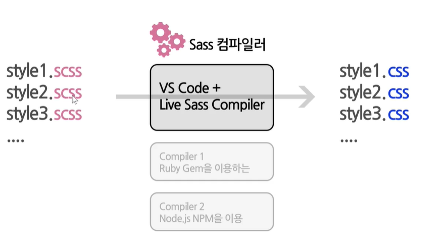

# SCSS Tutorials

> [CSS에 날개를 달아주는 Sass (SCSS)](ttps://www.udemy.com/course/css-sass-scss/) 강좌를 공부하면서 정리한 내용들입니다.

## SCSS란

-   **CSS 전처리기 (CSS pre-preocessor)**
-   CSS가 동작하기 전에 사용하는 것으로서 웹(브라우저)에서는 CSS만이 인식할 수 있기때문에 CSS 전처리기를 컴파일하여 CSS파일로 만들어야함
-   일반 CSS에서 좀 더 확장된 개념이라고 생각하면 됨
-   기존 CSS의 한계와 단점을 보완하여 보다 가독성이 높고 코드의 재사용이 유리한 CSS를 생성하기 위한 CSS의 확장
-   그 외 Less, Stylus 등이 CSS전처리기로 사용됨
-

## SCSS vs Sass

-   Sass
    -   SCSS와 작성하는데 구조적차이가 존재
    -   SCSS에 비해 번거롭고 복잡함
    -   syntax : 유효범위를 `들여쓰기`를 사용, 세미콜론 없음
-   SCSS
    -   기존의 CSS와 유사하게 작성 가능(CSS 구문과 완전 호환)
    -   Sacc의 Superset(상위집합)
    -   syntax : 유효범위를 `{ }`를 사용, 세미콜론 있음

## SCSS(Sacc)가 작동하는 과정



> 여기서는 Live Sass compiler를 사용함

## Syntax

### Variable(변수) 
- $변수명 : 변수값;
 
```SCSS
    $bg-color : #eee;

    body {
        background : $bg-color;
    }
```

- 변수의 활용

```SCSS
$yellow: #fce473;
$pink: #c71585;
$green: #32cd32;

$primary-color : $green;

.quote{
    border : 1px solid $primary-color;
}
```


### Nesting
- 태그의 깊이를  `{ }`로 표현하여 부모-자식관계로 표현할 수 있게 하는 문법
- 시각적으로 CSS의 포함관계를 알 수 있음
- 너무 복잡하고 긴 nesting은 오히려 직관성을 해칠 수 있음
- nesting은 CSS selector간의 우선순위를 명확하게 하기위해서 사용하는 것
```HTML
<div>
    box1
    <div>box2</div>
</div>   
```
```SCSS
div {
    //style
    div {
        //style
    }
}
```

### Nesting과 &(ampersand)
- nesting을 할 때, selector를 중복하여 사용하지말고 대신 `&`를 사용하자
- `&`는 상위(부모) selector를 나타냄

```SCSS
.parent{
    &.child{
        //style
    }
    &:hover{
        //style
    }
}
```
```CSS
.parent.child{}
.parent:hover{}
```

- `&` 로 자식과 자손관계 표현하기
  - 자식 : 특정요소의 직계 자손만을 선택하는 경우, 1깊이에 있는 요소들을 말함
    - 표현 : `A > B` (부등호)
  - 자손 : 특정요소의 자식, 손자, 후손 모두를 선택하는 경우
    - 표현 : `A B` (공백)

```SCSS

```